# NoMoreProcrastination.app - демонстрационный проект

> **Цель проекта** - показать применение актуальных технологий и практик разработки: от локальной сборки до CI/CD, мониторинга и логирования.  
> Приложение реализует простой, но полный цикл: **бэкенд + фронтенд + безопасность + тестирование + деплой**.

**Демо-версия**: [https://tasker-tlu7.onrender.com/](https://tasker-tlu7.onrender.com/)
> **Дисклеймер:** проект размещён на **бесплатном тарифе Render**.  
> При первом запросе после простоя контейнер **запускается ~2–3 минуты**.  
> Если страница долго не грузится - подождите, это нормально для бесплатного тарифа.

---

## Оглавление

- [О проекте](#о-проекте)
- [Архитектура](#архитектура)
- [Технологии](#технологии)
- [Локальный запуск](#локальный-запуск)
- [CI / CD](#ci--cd)
- [Мониторинг](#мониторинг)
- [Логирование](#логирование)
- [Тестирование](#тестирование)
- [Документация API](#документация-api)

---

## О проекте

**NoMoreProcrastination.app** - это веб-приложение для управления задачами (To-Do List) с поддержкой:
- Аутентификации пользователей
- CRUD-операций с задачами
- Установки приоритета (Низкий / Средний / Высокий)
- Отметки о выполнении
- Автоматической даты создания

Приложение состоит из:
- **Бэкенда** на Spring Boot (REST API)
- **Фронтенда** на Vanilla JS + Thymeleaf
- **Базы данных** PostgreSQL (в продакшене) / H2 (в тестах)

---

## Архитектура



1. Пользователь взаимодействует с UI (Thymeleaf + JS).
2. Фронтенд отправляет запросы на `/api/**`.
3. Spring Boot обрабатывает запросы, проверяет аутентификацию.
4. Данные сохраняются в PostgreSQL.

---

## Технологии

| Категория       | Стек                                                                 |
|------------------|----------------------------------------------------------------------|
| **Бэкенд**       | Spring Boot 3, Spring Security, JPA / Hibernate                      |
| **База данных**  | PostgreSQL (prod), H2 (tests), **Flyway (миграции схемы)**           |
| **Фронтенд**     | Thymeleaf, Vanilla JavaScript, CSS                                   |
| **Сборка**       | **Gradle**                                                           |
| **Контейнер**    | Docker                                                               |
| **Деплой**       | Render (бесплатный хостинг)                                          |
| **CI/CD**        | Jenkins (локальный), Render API                                      |
| **Мониторинг**   | Spring Boot Actuator + Prometheus                                    |
| **Логирование**  | SLF4J + Logback                                                      |

> **Flyway** - инструмент миграций базы данных.  
> Все изменения схемы (таблицы, индексы) описаны в SQL-файлах в `src/main/resources/db/migration/`.  
> При старте приложения Flyway автоматически применяет миграции в правильном порядке.

---

## Локальный запуск

1. Убедиться, что установлено:
    - Java 17+
    - Gradle (или используйте wrapper)

2. Запустить приложение:
   ```bash
   ./gradlew bootRun
3. Открыть в браузере   [http://localhost:8080](http://localhost:8080)

 Для запуска нужна PostgreSQL, настройки указать в application-local.properties
 Flyway применяет миграции из db/migration/ при старте.

---

## CI / CD

Проект поддерживает **полный цикл непрерывной интеграции и доставки**:

### 1. **Jenkins Pipeline** (локальный)
Развернуть Jenkins можно:
```bash
docker run -p 8080:8080 -p 50000:50000 jenkins/jenkins:lts
```

Pipeline включает этапы:
- **Build**: `./gradlew build -x test`
- **Test**:
    - Юнит-тесты (`./gradlew test --tests "*Test"`)
    - API-тесты (интеграционные, через `TestRestTemplate`)
    - (в планах) UI-тесты через Selenium
- **Deploy**: вызов Render API для автоматического деплоя

### 2. **Render (продакшен)**
- Билд собирается из GitHub (main ветка)
- Деплой - через REST API Render (настраивается в Jenkins)

## Мониторинг

Подключён **Spring Boot Actuator** для диагностики:

- **Health-check**:  
  -  Локально: `http://localhost:8081/actuator/health`  
  -  В продакшене: [`https://tasker-tlu7.onrender.com/actuator/health`](https://tasker-tlu7.onrender.com/actuator/health)  
  
  Включает проверку подключения к базе данных (статус `UP`/`DOWN`).

- **Метрики в формате Prometheus**:  
   Локально: `http://localhost:8081/actuator/prometheus`  
   В продакшене: [`https://tasker-tlu7.onrender.com/actuator/prometheus`](https://tasker-tlu7.onrender.com/actuator/prometheus)

>  Actuator вынесен на **отдельный порт `8081`** в локальной среде и доступен без аутентификации.  
> На Render порт объединён с основным (`8080`), но эндпоинты остаются открытыми для мониторинга.

---

## Логирование

- Используется **SLF4J + Logback** (встроено в Spring Boot).
- Все логи пишутся:
    - В **консоль** (`stdout`).
    - В файл **`logs/app.log`**.
- В **продакшене** :
    - Логи доступны через веб-интерфейс Render (вкладка **Logs**).
    - При локальном запуске в Docker - через команду:
      ```bash
      docker logs <container>
      ```

---

## Тестирование

Проект покрыт тремя уровнями тестов:

| Уровень        | Технология                             | Примеры                                      |
|----------------|----------------------------------------|----------------------------------------------|
| **Юнит-тесты** | JUnit 5 + Mockito                      | Логика `TodoService`, валидация              |
| **API-тесты**  | `@SpringBootTest` + `TestRestTemplate` | Создание/чтение задач через REST API |
| **UI-тесты**   | Selenium (в планах)                    | Прокликивание сценариев в браузере           |

Запуск тестов:
```bash
./gradlew test
```

---

## Документация API

Проект поддерживает автоматическую генерацию документации через OpenAPI 3.0.

- **Интерактивный интерфейс (Swagger UI)**:  
 [https://tasker-tlu7.onrender.com/swagger-ui.html](https://tasker-tlu7.onrender.com/swagger-ui.html)

- **Машинно-читаемая OpenAPI-спека (JSON)**:  
 [https://tasker-tlu7.onrender.com/v3/api-docs](https://tasker-tlu7.onrender.com/v3/api-docs)
